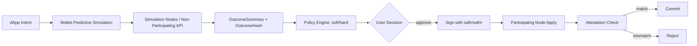
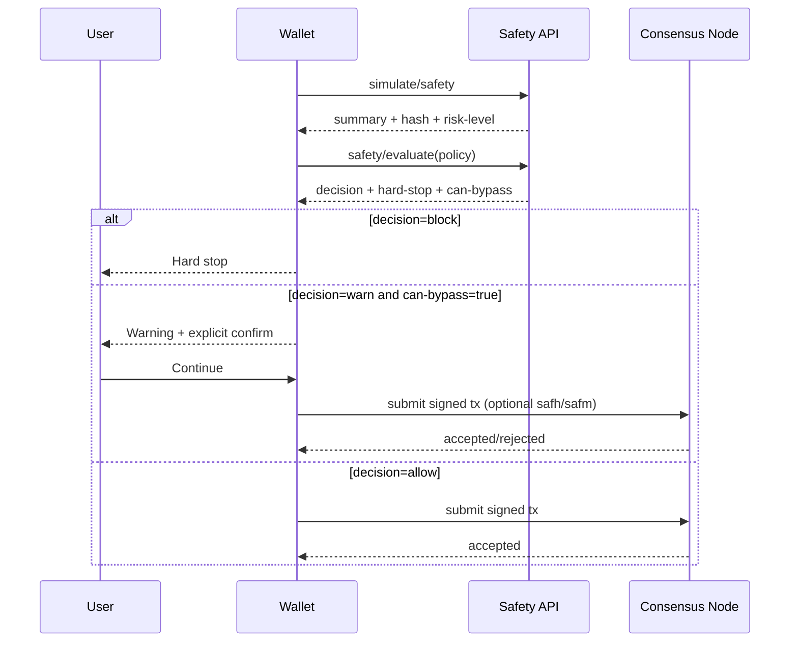

# RFC: Global Transaction Safety Mode (GTSM)

## Status

1. Stage: Draft (implementation-backed).
2. Intended audience: node operators, wallet teams, API integrators, and protocol reviewers.
3. Scope: deterministic transaction safety analysis and optional execution-time attestation.

## Abstract

Global Transaction Safety Mode (GTSM) makes transaction intent verifiable before signing and optionally enforceable at execution time.

GTSM combines three layers:

1. Deterministic simulation: produce canonical `OutcomeSummary` + `OutcomeHash`.
2. Policy evaluation: classify risk with soft/hard enforcement decisions.
3. Protocol attestation: reject execution if on-chain effects do not match expected effects.

The design goal is to balance system performance and user psychology:

1. Keep node overhead bounded and predictable.
2. Minimize warning fatigue for safe, routine transactions.
3. Hard-stop only for mathematically high-risk conditions.

## Motivation

Most losses are not consensus failures. They are intent failures:

1. Users sign groups they do not fully understand.
2. Frontends omit or obscure side effects.
3. Wallets over-warn and train users to click through alerts.

GTSM moves safety from visual inspection to deterministic checks.

## Specification

### Normative Language

The key words MUST, MUST NOT, SHOULD, SHOULD NOT, and MAY in this document are to be interpreted as described in RFC 2119 and RFC 8174.

### Scope and Non-Goals

#### In Scope

1. Deterministic pre-sign outcome summarization.
2. Deterministic policy evaluation with explicit soft/hard enforcement.
3. Optional execution-time attestation using `safh` and `safm`.

#### Out of Scope

1. Smart-contract semantic correctness proofs.
2. Private key custody and signer compromise prevention.
3. Protection against malicious simulation infrastructure without independent trust controls.

### Determinism Contract

For a fixed tuple of:

1. transaction group bytes,
2. simulation request parameters,
3. ledger state at a specific round,

the produced `outcome-summary`, `outcome-hash`, and `risk-signals` MUST be identical across compliant implementations.

A compliant implementation MUST:

1. Avoid wall-clock, random, or node-local mutable values in summary/hash generation.
2. Apply stable sorting to all unordered collections before output/hash derivation.
3. Keep the hash domain separator versioned and immutable within a protocol generation.

### Canonicalization and Hash Input Rules

`OutcomeHash` is a commitment to canonical post-apply effects. Implementations SHOULD preserve these invariants:

1. Include deterministic transaction effects, apply data, and inner-transaction effects.
2. Exclude attestation control fields (`safh`, `safm`) from hash input to avoid self-reference.
3. Preserve domain separation (`GTSM-OUTCOME-v1`) for collision and cross-context safety.
4. Treat empty/default fields consistently across encoding paths.

### Decision Semantics Matrix

The policy decision model is intentionally simple and deterministic:

| Enforcement Mode | Violations Present | Contains `error` Severity | Decision | Allowed | Hard Stop | Can Bypass |
|---|---:|---:|---|---:|---:|---:|
| `soft` | no | no | `allow` | true | false | true |
| `soft` | yes | no | `warn` | true | false | true |
| `soft` | yes | yes | `warn` | true | true | true |
| `hard` | no | no | `allow` | true | false | true |
| `hard` | yes | no | `block` | false | true | false |
| `hard` | yes | yes | `block` | false | true | false |

For unavailable verification (`verification-status=unavailable`), decision semantics follow policy fallback settings such as `allow-bypass-if-unavailable`.

### Layered Architecture



### Performance and Latency Strategy

#### 1. Parallel Execution and Caching

Because `OutcomeSummary` is deterministic for a given request and ledger context, implementations SHOULD:

1. Cache recent simulation/evaluation outputs.
2. Reuse deterministic decoding/canonicalization pipelines.
3. Bound cache memory with fixed entry limits and short TTLs.

Current implementation includes an in-process bounded LRU+TTL cache in the safety handler path for both simulate and evaluate endpoints.

#### 2. Off-load to Non-Participating Nodes

High-throughput wallets SHOULD use dedicated simulation infrastructure:

1. Participating nodes: consensus critical path only.
2. Non-participating/simulation nodes: API heavy lifting.

This preserves block production performance while keeping safety checks responsive.

#### 3. Predictive Simulation

Wallets SHOULD start simulation when the signing screen opens (not when user presses final confirm).

Outcome by design:

1. Most users see near-zero extra waiting time.
2. Hash and summary are ready before final approval interaction.

### User Experience Strategy

#### 1. Human-Readable Summary First

Wallets SHOULD render deterministic summaries as intent text, not raw hashes.

Examples:

1. "You send 50 ALGO to X and receive 200 USDC."
2. "No rekey. No close remainder."

#### 2. Progressive Disclosure

GTSM policy supports two enforcement modes:

1. `soft`: warnings can be bypassed.
2. `hard`: violating conditions block signing/submission.

Default recommendation:

1. Low risk and trusted flows: soft mode.
2. High-risk or institutional/vault flows: hard mode.

#### 3. Allow-listing to Prevent Warning Fatigue

Use policy allow-lists to narrow expected apps/receivers:

1. `allowed-app-ids`
2. `allowed-receivers`

Known-good surfaces stay quiet unless behavior deviates from expected bounds.

### Graceful Degradation Model

When safety verification is unavailable (temporary API/network/path issues), wallets SHOULD:

1. Surface explicit "verification unavailable" state.
2. Require user acknowledgment.
3. Follow policy for fallback behavior (for example, `allow-bypass-if-unavailable`).

Recommended split:

1. Consumer wallets: optional bypass with strong warning.
2. Institutional vault policies: bypass disabled.

### Deterministic Risk Signals (No Heuristics)

Risk signals MUST remain mathematical facts from transaction effects, not probabilistic guesses.

Current signal set:

1. `rekeyChange`
2. `closeRemainderToUsed`
3. `assetCloseToUsed`
4. `appGlobalStateDelete`

Signals are generated from transaction/apply data only and sorted deterministically.

### API Surface

#### POST /v2/transactions/simulate/safety

Returns:

1. `outcome-summary`
2. `outcome-hash`
3. `risk-signals`
4. `risk-level` (`low|medium|high`)
5. `verification-status` (`verified|unavailable`)
6. `unavailable-reason` when unavailable
7. optional full simulation payload

Error behavior:

1. malformed request or invalid tx-group shape: HTTP 400
2. simulation unavailable/non-deterministic preconditions: deterministic `unavailable` response or HTTP 400 for invalid request classes

#### POST /v2/transactions/safety/evaluate

Request includes `policy` and returns:

1. `allowed`
2. `violations` (with severity)
3. `decision` (`allow|warn|block|unverified`)
4. `hard-stop` (bool)
5. `can-bypass` (bool)
6. `enforcement-mode` (`soft|hard`)
7. `verification-status` (`verified|unavailable`)
8. `unavailable-reason` when unavailable
9. `outcome-summary`
10. `outcome-hash`

Error behavior:

1. malformed request or invalid tx-group shape: HTTP 400
2. simulation/policy evaluation unavailable: deterministic `decision=unverified` response governed by bypass policy

### Policy Schema (Current)

`SafetyPolicy` fields:

1. `max-algo-outflow`
2. `max-asset-outflow`
3. `enforcement-mode` (`soft|hard`)
4. `allow-rekey`
5. `allowed-receivers`
6. `blocked-receivers`
7. `allowed-app-ids`
8. `blocked-app-ids`
9. `allow-app-global-deletes`
10. `max-inner-txns`
11. `high-risk-signals`
12. `allow-bypass-if-unavailable`
13. `required-risk-signals-absent`

### Protocol Attestation Layer

Transaction header fields:

1. `safh`: expected deterministic outcome hash.
2. `safm`: safety mode.

`SafetyMode`:

1. `0`: disabled.
2. `1`: enforce hash match.
3. `2`: enforce hash match and reject any risk signal.

Attestation keeps "receipt before execute" guarantees for high-assurance flows.

### Decision Flow Diagram



### Examples

#### 1. Example Policy

See [docs/examples/gtsm-policy.json](docs/examples/gtsm-policy.json).

#### 2. CLI Simulation

```bash
goal clerk safety simulate --txfile group.txn --include-simulation
```

Expected high-level output shape:

```json
{
  "outcome-summary": {
    "human-summary": [
      "Algo transfer: 50000000 microAlgos from A to B",
      "No deterministic risk signals detected"
    ]
  },
  "outcome-hash": "...",
  "risk-signals": [],
  "risk-level": "low",
  "verification-status": "verified"
}
```

#### 3. CLI Evaluation

```bash
goal clerk safety evaluate --txfile group.txn --policy docs/examples/gtsm-policy.json
```

Expected high-level output shape:

```json
{
  "allowed": true,
  "decision": "allow",
  "hard-stop": false,
  "can-bypass": true,
  "enforcement-mode": "soft",
  "verification-status": "verified",
  "violations": []
}
```

Unavailable-path output shape:

```json
{
  "allowed": true,
  "decision": "unverified",
  "hard-stop": false,
  "can-bypass": true,
  "verification-status": "unavailable",
  "unavailable-reason": "..."
}
```

### Implementation Status (This Repository)

Implemented now:

1. V2 safety simulation and policy-evaluation endpoints.
2. Deterministic outcome hash and signal generation.
3. CLI + libgoal + REST client support.
4. Policy-driven decision outputs: soft/hard, hard-stop, bypass.
5. Deterministic human-summary lines in `OutcomeSummary`.
6. In-process bounded cache for safety endpoint responses.
7. Structured graceful-degradation responses for temporary verification unavailability.

Deferred:

1. OpenAPI regeneration (`algod.oas2.json` + `make generate`) once system build dependencies are available.
2. Production-grade distributed simulation cache implementation.

### Performance Targets

1. <= 10% p95 simulation overhead versus baseline simulation path.
2. <= 2% p95 block apply overhead with safety mode disabled.
3. <= 6% p95 block apply overhead for attested groups.

### Algorand-Specific Design Principles

To remain production-grade in Algorand environments, GTSM SHOULD follow these principles:

1. Consensus-path neutrality: if `safm=0`, safety logic should have negligible impact on normal block processing.
2. Deterministic canonicalization: all hash/signals derive only from transaction + apply data, never wall-clock, node-local, or external state.
3. Fast failure semantics: malformed attestation fields fail early before expensive downstream processing.
4. Upgrade compatibility: new safety signals must be additive and version-gated to avoid changing prior deterministic commitments.

### Compatibility and Versioning

#### Protocol and Node Compatibility

1. Nodes that do not understand `safh`/`safm` should reject unsupported usage per normal protocol validation rules.
2. Mixed-version networks should enable safety-dependent UX flows only after confirming protocol support from connected nodes.
3. Wallets should cache capability detection and re-check on node version change.

#### Signal and Hash Evolution

1. The domain separator (`GTSM-OUTCOME-v1`) is versioned and immutable for current behavior.
2. Any future hash shape change MUST increment domain version and expose explicit migration behavior.
3. Policy engines should treat unknown future signals conservatively (warn by default unless explicitly allow-listed).

#### Signal Governance

To prevent behavior drift, new deterministic risk signals SHOULD be introduced with:

1. a stable name and specification,
2. explicit trigger conditions,
3. deterministic test vectors,
4. versioned rollout guidance for wallets and policy engines.

## Rationale

GTSM adopts deterministic, policy-driven enforcement to reduce user harm without introducing non-deterministic protocol behavior. The design chooses:

1. deterministic facts over probabilistic heuristics,
2. explicit soft/hard policy semantics over implicit UI rules,
3. optional attestation for high-assurance flows while preserving low-friction defaults.

## Backward Compatibility

1. Legacy safety simulate request payloads remain accepted where documented.
2. New risk signals are additive and should be version-governed.
3. Wallet capability checks should gate safety-dependent UX in mixed-version environments.

## Security Considerations

### Threat Model and Security Posture

GTSM addresses intent drift and execution mismatch threats, including:

1. Hidden rekey/close operations in transaction groups.
2. Unexpected app/global-local state mutation side effects.
3. Frontend mismatch between displayed intent and submitted payload.
4. Race windows between pre-sign simulation and final submit.

GTSM does not replace:

1. Smart contract audits.
2. Key management and signing hygiene.
3. Node/network trust assumptions.

Recommended hardening:

1. Pin simulation endpoint trust domain and TLS controls.
2. Bind sign-screen transaction bytes exactly to simulated bytes.
3. Enforce short staleness windows between simulation and submission.

## Operational Considerations

### Operational Readiness and Observability

#### Metrics

Operators should track at minimum:

1. `gtsm_simulate_requests_total` by status (`verified|unavailable|bad_request`).
2. `gtsm_evaluate_requests_total` by decision (`allow|warn|block|unverified`).
3. `gtsm_cache_hit_ratio` by endpoint.
4. `gtsm_simulation_latency_ms` p50/p95/p99.
5. `gtsm_attestation_reject_total` by reason (`hash_mismatch|risk_signal|invalid_mode`).

#### Logging

Log records SHOULD include:

1. request correlation id,
2. round context,
3. verification status,
4. decision and violation codes,
5. unavailability reason class (without leaking sensitive payload details).

#### SLO Suggestions

1. Safety API availability: >= 99.9% monthly.
2. Simulate/evaluate p95 latency budget: <= wallet interaction threshold (for example, <= 300ms on warm cache).
3. False-block rate target: effectively zero for policy-compliant transactions.

### Rollout Strategy

1. Phase 1 (observe): run simulate/evaluate in shadow mode and collect baseline metrics.
2. Phase 2 (advise): enable soft-mode warnings for selected high-risk flows.
3. Phase 3 (enforce): activate hard-mode on institutional or high-value routes.
4. Phase 4 (attest): roll out `safh`/`safm` for flows requiring execution-time guarantees.

Rollback plan:

1. Keep policy toggles runtime-configurable.
2. Fall back from hard to soft while retaining telemetry.
3. Disable attestation-only for affected flows during incident response.

## Conformance

### Conformance Checklist

An implementation is operationally conformant when all items hold:

1. Determinism: identical `outcome-hash` across repeated runs at fixed round/context.
2. Decision semantics: outputs match the decision matrix for soft/hard modes.
3. Degraded mode: unavailable behavior is explicit and policy-governed.
4. Attestation: mismatched outcome hash is rejected at apply time when enabled.
5. Telemetry: required metrics and audit-grade logs are emitted.
6. Backward compatibility: legacy simulate payload path remains supported where documented.

## Implementation Guidance

### Wallet and API Best Practices

1. Precompute safety during UI rendering, not only on final confirmation click.
2. Present human-summary first and technical fields second.
3. Show exact blocked rule code and remediation hint for each violation.
4. Prevent "warning fatigue" by allow-listing trusted repetitive flows.
5. Require explicit user confirmation when `decision=unverified` and bypass is allowed.

## Future Work

### Future Enhancements

1. Optional signed safety receipts for auditable off-chain policy decisions.
2. Structured violation remediation hints in API responses.
3. Cluster-aware distributed cache for simulation-heavy deployments.
4. Additional deterministic, versioned risk signals for advanced app-side effects.

## Test Plan

1. Unit tests: canonicalization, signal extraction, policy decision semantics.
2. Integration tests: endpoint behavior and deterministic responses.
3. E2E tests: predictive simulation + evaluation + optional attestation submit.

## Appendix: Security Notes

1. Domain-separated hashing is mandatory.
2. Risk signals remain deterministic facts.
3. Hard-stop paths should be enabled by policy, not ad-hoc UI logic.
4. Fallback/bypass must be explicit and auditable.
